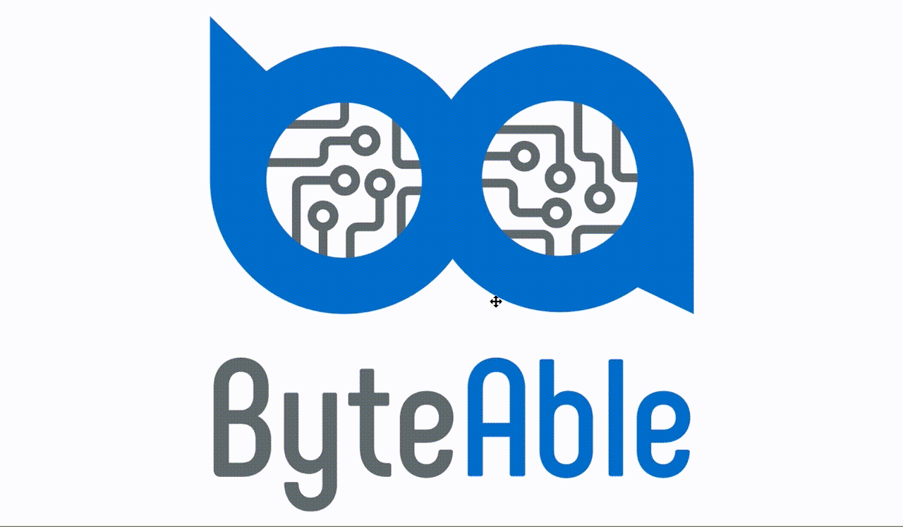

# Questron Ch5
Quasar Framework with integrated Crestron Ch5 support and custom components.



## Intro
As a Crestron Programmer who knows a little VueJS, Crestron Ch5 was an exciting prospect. Unfortunately, I'm not particularly fond of Anguar, and the Crestron Ch5 Components are quite unattractive. I like the styling offered by Quasar, so wanted to build my own library to take advantage of these components.

I'll be building new components as required for projects, and also welcome contributions and suggestions.

This repository is essentially a demo app that can be customised as required for your project.

## Local Development
Use Chrome for local development, and Emulate a touch device. The components use touch directives extensively, and may not work properly when in "desktop" (using a mouse).

https://developers.google.com/web/tools/chrome-devtools/device-mode


## TODO
- [ ] Complete Button API Docs
- [ ] Complete Vertical Slider API Docs
- [ ] Add Horizontal slider component
- [ ] Add router (page flip) functionality to Button


## Questron Custom Component API
### Button
A simple button with a join prop to connect to crestron join number.

### Vertical Slider
A customisable Vertical slider element that outputs an analog value. Includes increment, decrement and mute buttons (if required), and also takes care of the value adjustment - no need to use a ramp module in the Simpl program!
Default is to listen to feedback on the same join number, or can just use internal value if required.
Docs coming soon, please view demo source for examples on how to implement.


## Getting Started
### Install the dependencies
```bash
npm install
```

### Start the app in development mode (hot-code reloading, error reporting, etc.)
```bash
quasar dev
```

### Build the app for production/archive for deployment to touchpanel
```bash
npm run build
```

### Send built project to touchpanel
```bash
npm run send <PANEL_IP_ADDRESS/HOSTNAME>
```
